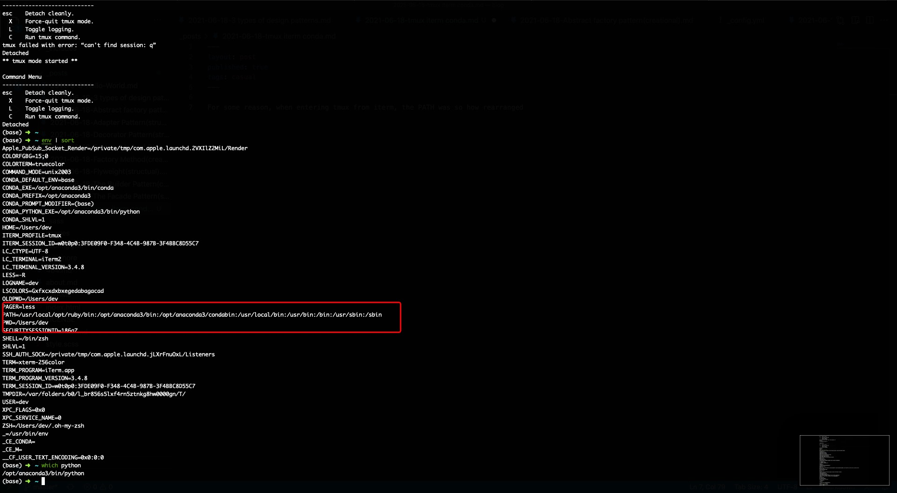
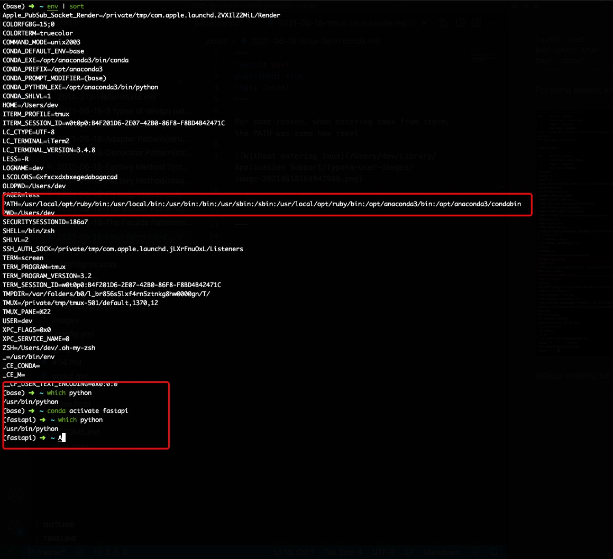

For some reason, when entering tmux from iterm, the $PATH was somehow reset which leads to mismatching of Conda's Python from the system's one.



*without entering tux*

---



*tmux entered*

---


## Solution

Added the following code to ~/.zshrc

```bash
# tmux conda issue
[[ -z $TMUX ]] || conda deactivate; conda activate base
```

