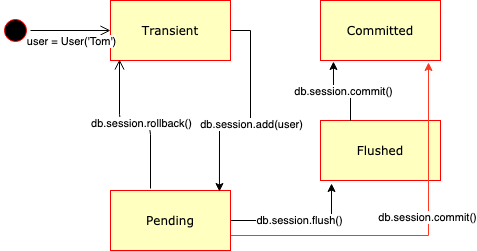

# Definition

## Transaction

A series of changes.

## Session

A series of transactions during a database connection.

# States

- Transient: when transactions **have *not* been attached** to any session.
- Pending: when transactions **have been attached** to a session.
- Flushed: when transactions have been marked as **visible by other tractions in the *same* session**.
- Committed: when transactions **have been persisted** to the database.(will always trigger the Flushed state)




```python
#---
s = Session()

s.add(Foo('A')) # The Foo('A') object has been added to the session.
                # It has not been committed to the database yet,
                #   but is returned as part of a query.
print 1, s.query(Foo).all()
s.commit()

#---
s2 = Session()
s2.autoflush = False

s2.add(Foo('B'))
print 2, s2.query(Foo).all() # The Foo('B') object is *not* returned
                             #   as part of this query because it hasn't
                             #   been flushed yet.
s2.flush()                   # Now, Foo('B') is in the same state as
                             #   Foo('A') was above.
print 3, s2.query(Foo).all() 
s2.rollback()                # Foo('B') has not been committed, and rolling
                             #   back the session's transaction removes it
                             #   from the session.
print 4, s2.query(Foo).all()

#---
Output:
1 [<Foo('A')>]
2 [<Foo('A')>]
3 [<Foo('A')>, <Foo('B')>]
4 [<Foo('A')>]
```


# Reference

- [Ilja Everilä & snapshoe](https://stackoverflow.com/a/4202016/7481133)
- [Shravan Kuchkula](https://shravan-kuchkula.github.io/sqlalchemy-object-lifecycle/#)

